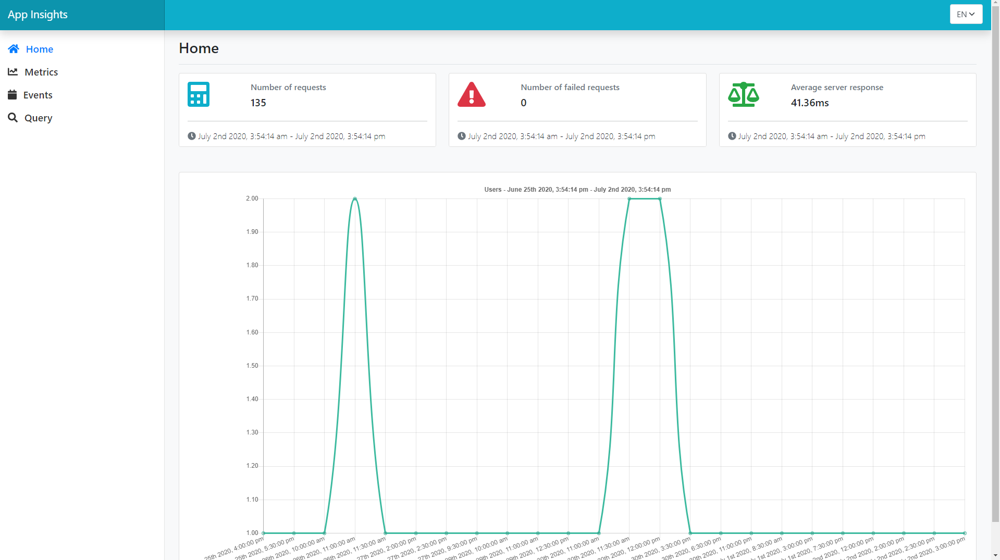

# AppInsights

It is a simple project to consume Application Insights REST API

## Built With

* [Angular CLI](https://github.com/angular/angular-cli) Angular is an application design framework and development platform for creating efficient and sophisticated single-page apps (10.0.0)
* [Bootstrap](https://v5.getbootstrap.com/) - Bootstrap is an open source toolkit for developing with HTML, CSS, and JS (5.0.0-alpha1)
* [Chart.js](https://www.chartjs.org/) - Simple yet flexible JavaScript charting for designers & developers

## Prerequisites
* [Azure Application Insights](https://dev.applicationinsights.io/reference) The Application Insights REST API lets you query the performance and usage data that Application Insights records about your app.
    It's necessary to change the attributes 'appId' and 'appKey' in the file environment.ts

## Development server

Run `ng serve` for a dev server. Navigate to `http://localhost:4200/`. The app will automatically reload if you change any of the source files.

## Code scaffolding

Run `ng generate component component-name` to generate a new component. You can also use `ng generate directive|pipe|service|class|guard|interface|enum|module`.

## Build

Run `ng build` to build the project. The build artifacts will be stored in the `dist/` directory. Use the `--prod` flag for a production build.

## Running unit tests

Run `ng test` to execute the unit tests via [Karma](https://karma-runner.github.io).

## Running end-to-end tests

Run `ng e2e` to execute the end-to-end tests via [Protractor](http://www.protractortest.org/).

## Further help

To get more help on the Angular CLI use `ng help` or go check out the [Angular CLI README](https://github.com/angular/angular-cli/blob/master/README.md).

## Contributing

Pull requests are welcome. For major changes, please open an issue first to discuss what you would like to change.

